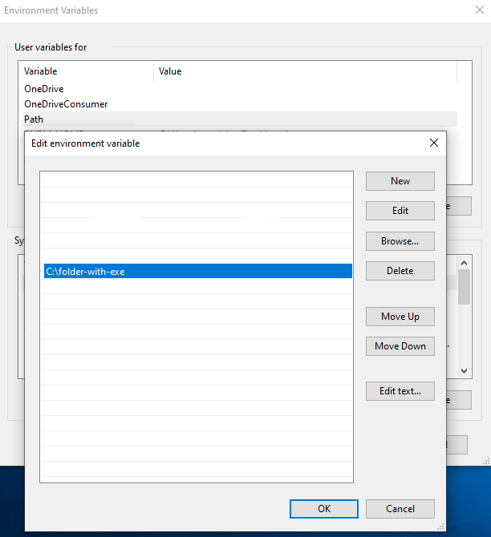

build command

```
dotnet publish -c Release -r win-x64 --self-contained true -p:PublishSingleFile=true -p:PublishTrimmed=true
```

folder
```
bin\Release\net8.0\win-x64\publish
```

install

- put the exe in a folder
- add the folder to  environment variable under Path


usage

```
                                                                                           who                                    - Show current git config                                                        use <profile name>                     - Use selected profile                                                           create <name> <email> <profile name>   - Create a new profile                                                           delete <profile name>                  - delete profile                                                                 list                                   - List all profiles                                                              help                                   - help                                                                                                  
         ````